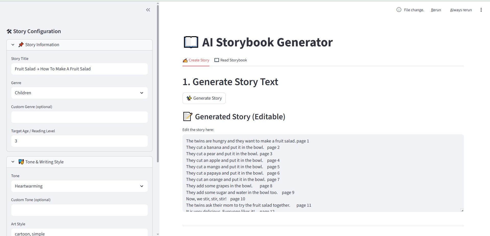
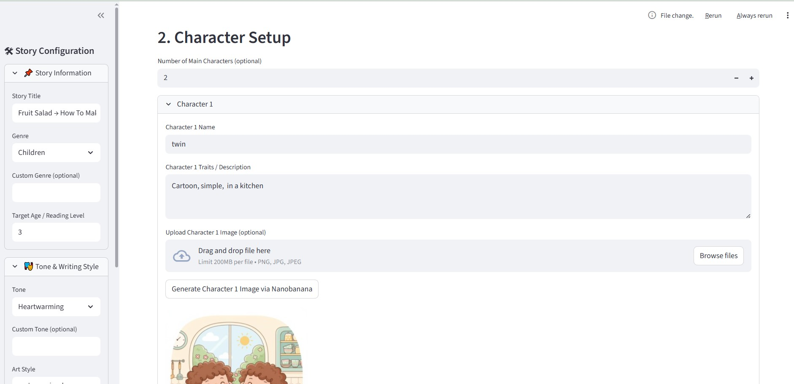
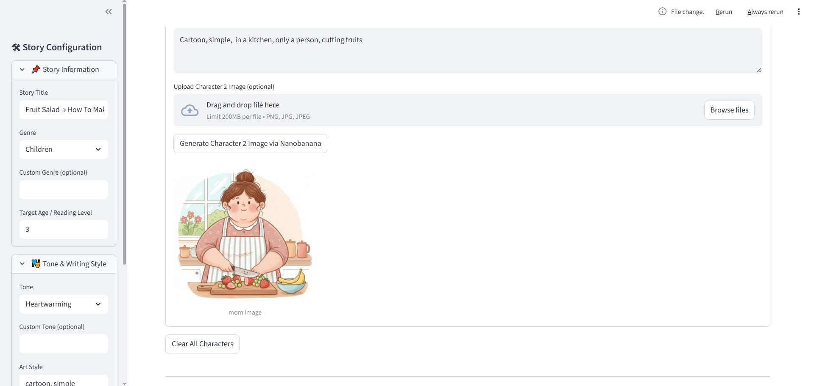
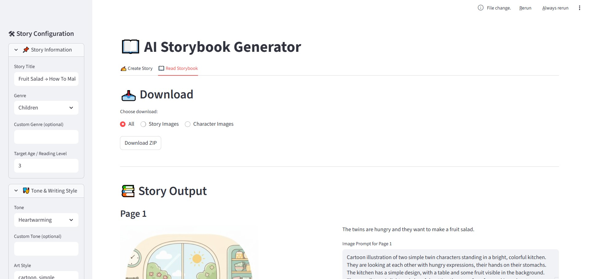
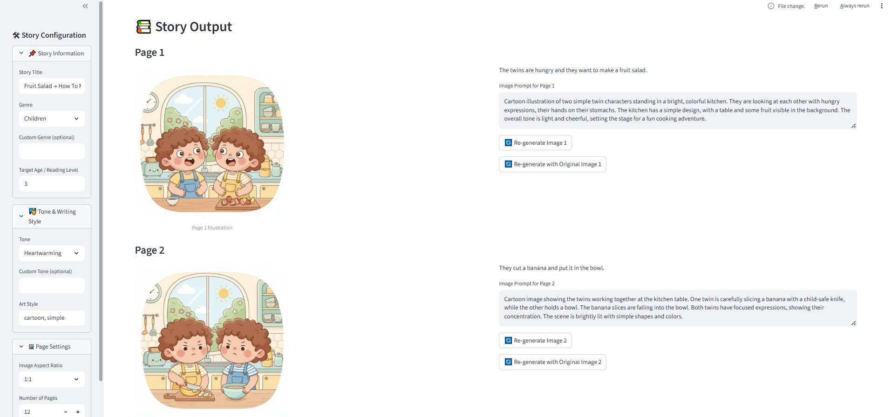

# 📖 Storybook AI Generator

## Overview
The **Storybook AI Generator** is an interactive web application built with **Streamlit** and **Google Gemini AI**. It allows users to generate complete, fully illustrated storybooks from a simple title and genre. The tool uses advanced Large Language Models (LLMs) to write the story and character descriptions, and state-of-the-art image generation models to create consistent illustrations for every page.






## ✨ Key Features

### 1. Story Generation
- **Customizable Settings**: Define your story's Title, Genre, Tone, Art Style, Target Age, and Page Count.
- **AI Writer**: Automatically generates a cohesive story script divided into pages, along with detailed image prompts for each scene.

### 2. Character Consistency & Customization
- **Character Setup**: The AI identifies main characters and generates their physical descriptions.
- **Visual Consistency**: You can generate reference images for your characters or upload your own. These reference images are used during the story generation process to ensure characters look the same across different pages.
- **Image-to-Image Refinement**: If you're not happy with a character's look, you can regenerate it using the existing image as a base to refine the design while keeping the pose or composition.

### 3. AI Illustration
- **Batch Generation**: Generates illustrations for the entire story in one go.
- **Smart Prompts**: Uses context-aware prompts that include character descriptions to maintain visual continuity.

### 4. Interactive Editing & Regeneration
- **Read Mode**: View your generated storybook side-by-side with text and images.
- **Regeneration**: Don't like a specific page's illustration? You can:
    -   **Edit the Prompt**: Tweak the text description and regenerate.
    -   **Re-generate**: Create a completely new image.
    -   **Re-generate with Original**: Use the current image as a reference to make subtle changes (Image-to-Image).

### 5. Export
- **Download**: Export all your generated assets (Story Images and Character Images) as a structured ZIP file, ready for publishing or sharing.

---

## 🛠️ Installation & Setup

### Prerequisites
- Python 3.8 or higher
- A Google Cloud Project with the **Gemini API** enabled.
- An API Key for Google GenAI.

### Installation

1.  **Clone the repository** (if applicable) or download the source code.
2.  **Install dependencies**:
    ```bash
    pip install -r requirements.txt
    ```

## 🚀 How to Use

### Step 1: Configuration (Sidebar)
- Open the sidebar to set up your story metadata:
    -   **Title**: e.g., "The Brave Little Toaster"
    -   **Genre**: e.g., Adventure, Fantasy
    -   **Tone**: e.g., Whimsical, Dark
    -   **Art Style**: e.g., Watercolor, 3D Pixar Style
    -   **Page Settings**: Aspect ratio and number of pages.

### Step 2: Create Story (Tab 1)
1.  **Generate Story Text**: Click the "Generate Story" button. The AI will write the plot and define characters.
2.  **Character Setup**:
    -   Review the generated characters.
    -   (Optional) Edit their names or traits.
    -   **Generate Images**: Click "Generate Character Image via Nanobanana" for each character.
    -   **Refine**: Use "Re-generate Character with Original Image" if you want to tweak the look.
3.  **Generate Illustrations**: Once characters are set, click "Generate Images" at the bottom.

### Step 3: Read & Refine (Tab 2)
- Switch to the **"Read Storybook"** tab.
- Scroll through your story pages.
- If an image isn't quite right:
    -   Edit the text in the "Image Prompt" box.
    -   Click **"Re-generate Image"** for a fresh take.
    -   Click **"Re-generate with Original Image"** to modify the existing picture.

### Step 4: Download
- Use the **Download** section in Tab 2 to save your work. You can choose to download just the story images, just the characters, or everything in a ZIP file.

---

## 📂 Project Structure

- **`main.py`**: The main Streamlit application file containing the UI logic and workflow.
- **`utils/`**:
    -   **`llm_utils.py`**: Functions for interacting with the LLM to generate story text and prompts.
    -   **`image_utils.py`**: Functions for interacting with the Image Generation API (Text-to-Image and Image-to-Image).
- **`characters/`**: Directory where generated character reference images are stored.
- **`images/`**: Directory where generated story illustrations are stored.

---

## 🤖 Technologies Used
- **Streamlit**: For the web interface.
- **Google Gemini 2.5 Flash**: For high-speed, high-quality text and image generation.
- **Python**: Core programming language.
